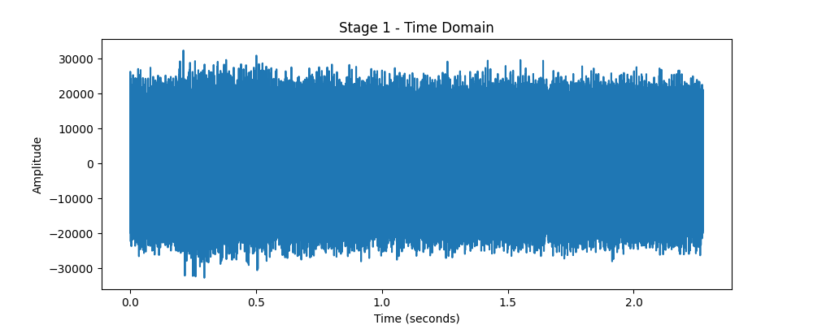
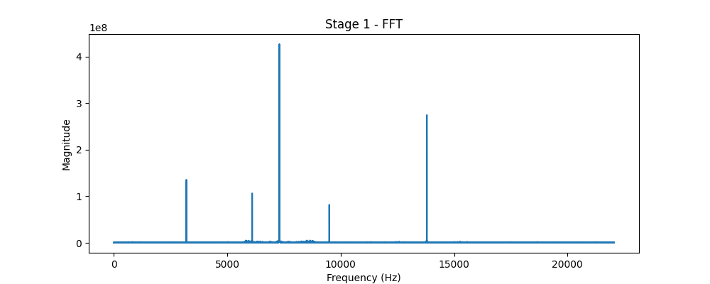
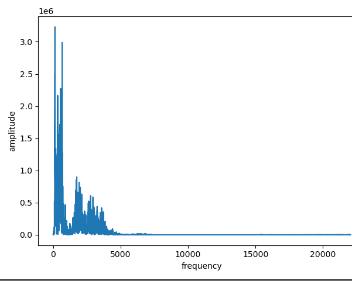
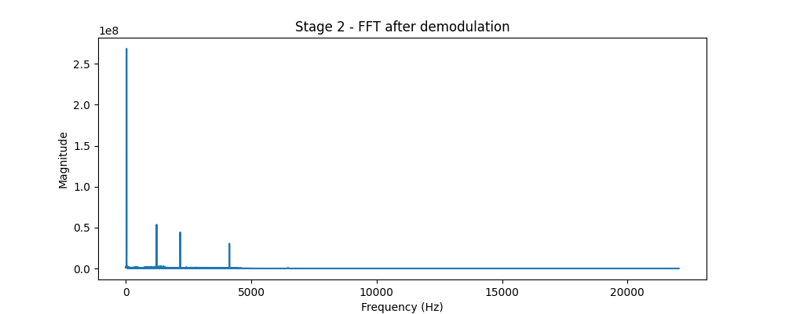
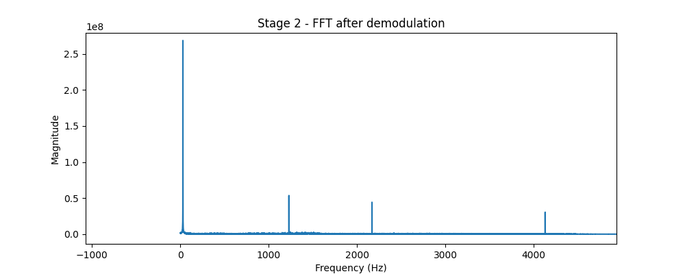
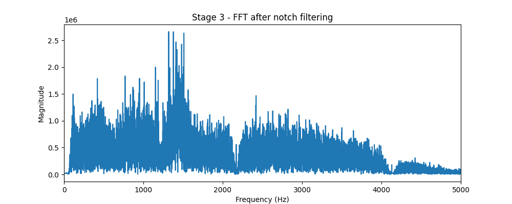

# Signal Processing Task: The Corrupted Transmission

## Tools Used
Python 3, NumPy, SciPy (wavfile, butter, filtfilt, iirnotch), Matplotlib

---

## Stage 1 — Understanding the Received Signal

The number of snapshots taken per second comes out to be 44100, which would be the value of max frequency x 2 (crests and troughs), so the maximum frequency measured by this would be 44100/2 = 22050.

FFT (Fast Fourier Transformation) basically says that any wave can be broken down into a sum of sine waves, of different frequency and amplitudes. So, it fundamentally tells about how much of each frequency is present in that wave.

### Time Domain
Examining this graph, we can conclude that this isn't a normal audio of a human speech — the amplitude is consistently high throughout the entire 2.28 seconds, constantly hitting near maximum values with almost no quiet sections, which is not how normal speech looks.

### FFT
This was the FFT graph obtained, which looks very distinct from a normal FFT graph of speech (ranging from 0–4000 Hz), it almost has no broad energy. Also, sharp narrow spikes are no element of human speech — these are just pure sine waves.

This is how a general FFT graph looks like for speech.

---

## Stage 2 — Demodulation

Our FFT graph shows two big spikes, one at approximately 7300.1953 Hz and the other at approximately 14000 Hz. The concept is that to frequency shift a wave you multiply it by a sine function of a particular carrier frequency (fc), which when thereafter plotted on an FFT graph, shows the fc itself and the amount of frequency it is shifted by. So in our case, the highest spike at 7300.1953 Hz is the fc, while 14000 is its second harmonic (14000/2 = 7000).

Now since we know the fc, what we can do is multiply our given audio by a sine wave of frequency fc again (because multiplying just shifts the graph, and multiplying twice gets back the same original one), and then apply a low pass filter to allow audio below 4000 Hz only.

**How does a low pass filter work, and why do we need it?** After multiplying the sine waves, the two frequencies will produce two outputs — one will be A - B and the other A + B. While we don't require A + B, it is just a garbage frequency for us. In that case we need something to filter out the higher garbage frequencies and retrieve only the lower frequencies, which is accurately done by a low pass filter.

---

## Stage 3 — Removing Artificial Tones

After demodulating we get all the frequencies in the range of 0–4000 Hz approx, but still there are sharp narrow spikes which are not exactly an element of human speech, so next up we remove these sharp spikes.

Next steps would be to remove the unwanted energy or the low frequency garbage sitting near 0 Hz and also the spikes specifically at 1200.1, 2199.9, and 4100.1 Hz.

We can use a **high pass filter** to remove the frequencies near 0, and use something called a **notch filter** which basically removes particular frequencies and a very narrow region around it, for the 3 frequencies.

The cutoff frequency for the high pass filter was initially too low, so it was changed to 80 Hz.

Now this surely looks like a FFT graph of speech.

---

## Stage 4 — Phase Investigation

Although the README says this may seem to be what we actually needed, the audio might still not be comprehensible. One thing which can be done that still won't change the FFT graph but will surely mess with the audio is reversing the audio — since FFT just measures the amount of each frequency present in the wave, it doesn't matter if we input the audio wave as reversed, the FFT will still be the same.

I did try reversing it, but that didn't sound anything logical. The non-reversed cleaned signal produced clear, intelligible audio containing the recovered sound. The reversal may have been corrected in the demodulation phase, so I concluded my search with the recovered audio itself.
